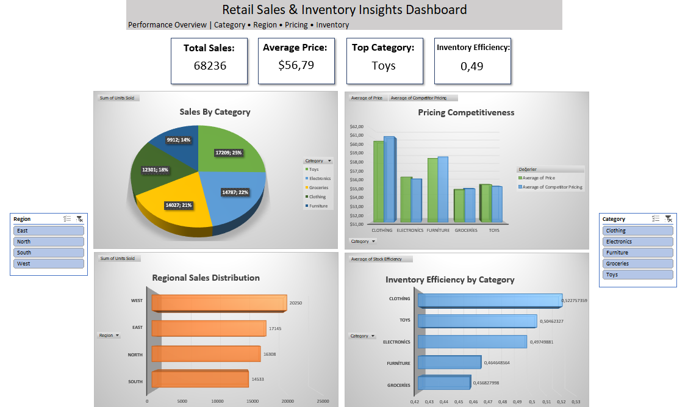

Retail Sales & Inventory Analysis
📌 Project Overview

This project presents a comprehensive analysis of retail sales and inventory management using a structured subset of the Retail Sales Dataset from Kaggle. The analysis was conducted entirely in Excel, combining data cleaning, feature engineering, visualization, and statistical modeling to uncover actionable business insights.

The primary objective is to evaluate sales performance, pricing strategies, and inventory efficiency, while providing data-driven recommendations to support operational and strategic decision-making.

🎯 Problem Statement

Retail businesses must balance inventory levels with fluctuating customer demand while remaining competitive in pricing. Poor inventory planning can lead to overstocking, stockouts, and lost revenue.
This project aims to answer key business questions:
Which product categories drive the highest sales?
How does demand vary across regions and seasons?
Are current pricing strategies competitive?
How efficiently is inventory being utilized?

### Project Dashboard

### statistical Analysis & Pivot Tables

📂 Dataset
Source: Kaggle – Retail Sales Dataset
Sample: First 500 records selected as a structured and manageable subset for analysis

⚠️ Data Limitation
The analysis is based on a limited sample size (500 records), which may not fully capture all patterns present in the complete dataset. Future analyses could benefit from using a larger or randomly sampled dataset for improved generalizability.

🛠️ Data Preparation & Cleaning
The dataset was reviewed and prepared to ensure consistency and usability:
Checked for missing values and inconsistencies
Verified data types and formatting
No critical data quality issues were identified
eature Engineering

To enhance analytical depth, two key business metrics were developed:

Stock Efficiency = Units Sold / Inventory Level
→ Measures how effectively inventory is converted into sales
Price Difference = Company Price – Competitor Price
→ Evaluates competitive pricing position in the market

📊 Analysis & Visualization
📌 Executive Dashboard
An interactive Excel dashboard was developed to provide a high-level overview of performance.
Features:
Sales by Category
Regional Sales Distribution
Pricing Competitiveness
Inventory Efficiency
Dynamic slicers for Region and Category filtering

Target Users:
Operations managers, supply chain teams, and business analysts

📈 Key Insights
1. Sales by Product Category
Toys generate the highest sales volume
→ Indicates strong demand and growth potential
2. Sales Performance by Region
The West region leads in total sales
→ Suggests regional demand concentration
3. Seasonal Demand Analysis
Demand peaks in Spring and drops in Autumn
→ Highlights clear seasonal patterns
4. Pricing Strategy
Clothing has the highest average price
Groceries have the lowest
→ Reflects category-based pricing strategies
5. Inventory Efficiency
Clothing shows the highest stock efficiency
→ Indicates effective inventory utilization
6. Competitive Pricing
Electronics and Toys are priced higher than competitors
Other categories maintain a competitive pricing advantage

Business Recommendations
Based on the analysis, the following actions are recommended:

Optimize Inventory Allocation:
Increase stock levels for high-performing categories such as Toys

Seasonal Strategy Adjustment:
Implement promotional campaigns during low-demand periods (Autumn)

Pricing Strategy Improvement:
Reassess pricing in Electronics and Toys to remain competitive or justify premium positioning

Regional Focus:
Allocate more resources and marketing efforts to high-performing regions such as the West

Inventory Planning:
Use demand trends to improve stock replenishment strategies and reduce inefficiencies

📊 Key Performance Indicators (KPIs)
The dashboard includes dynamic KPIs for performance tracking:
Total Sales
Average Unit Price
Overall Stock Efficiency
Top Performing Category (automatically identified)

🔬 Statistical Modeling
To extend the analysis beyond descriptive insights, a Simple Linear Regression model was developed.

Model Specification
Dependent Variable (Y): Inventory Value
Independent Variable (X): Demand Forecast
Key Results
Multiple R: 0.40
→ Moderate positive relationship between demand and inventory investment
R²: 0.16
→ Indicates that demand explains 16% of inventory variation
Significance F: ~0
→ Model is statistically significant
Coefficient: 38.93
→ Each unit increase in demand forecast increases inventory value by ~38.93 units

## 🔮 Future Enhancements  
This project can be further improved with the following extensions:
- Implementing **What-if Analysis** to evaluate the impact of demand and pricing changes on inventory decisions  
- Expanding the dataset to improve the robustness and reliability of insights  
- Applying **advanced forecasting models** (e.g., time series analysis) for demand prediction  
- Incorporating additional variables such as promotions, seasonality, and lead times into predictive models
  
🧾 Conclusion
This project demonstrates how Excel can be effectively used for end-to-end data analysis, from data preparation to predictive modeling.
The findings provide valuable insights into sales performance, pricing strategy, and inventory efficiency, while offering actionable recommendations to support better business decisions.
